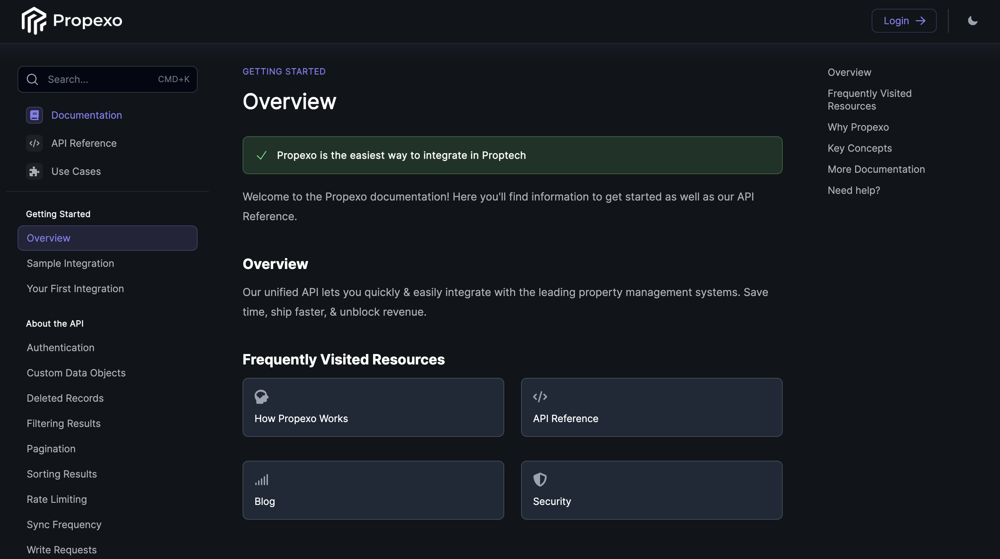

# Propexo Documentation

## What is contained in this repo ? 
This reposistory contains: 
- Propexo's latest [OpenAPI spec](./fern/openapi/openapi.yml)
- MDX [Pages](./fern/docs/pages/)

## How to update the documentation ? 

To update the documentation make a PR to this 
repository. On pull-request we run `fern check` 
to make sure that any edits to the documentation 
are valid. 

When the PR is merged, your changes will 
automatically be deployed to the website. 
